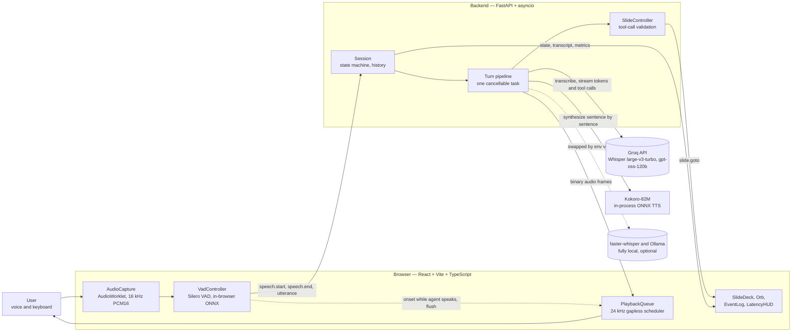

# Dynamic Voice Deck

A voice-first AI slide presenter: it answers spoken questions about the deck, navigates between slides by tool calls, and can be interrupted mid-sentence.

---

## Status

**v0.1.0 — in development.** The repository is at **Phase 0: scaffolding**. The voice loop described below is designed and specified in `docs/TRD.md`, but most of it is not built yet.

<!--
  MAINTAINER: update the "What works today" list at the end of EVERY phase.
  Rule: only list behaviour you have personally run. Anything designed but not
  merged belongs under "Not built yet", not here.
-->

**What works today**

- A FastAPI application skeleton with `GET /api/health`, which reports the app version, the selected provider names, and whether the TTS voice is warm.
- Typed configuration (`backend/app/config.py`) loaded from `.env`, with secrets masked in every representation.
- The application error hierarchy (`backend/app/errors.py`).
- Structured logging (`backend/app/logging_setup.py`): JSON when `LOG_JSON=true`, coloured console otherwise, with uvicorn's own records bridged through the same renderer.
- A Vite + React + TypeScript frontend that builds and runs, showing a **placeholder UI only** — no slides, no microphone, no audio.
- Tooling: `make` targets, ruff and `mypy --strict` for the backend, ESLint (type-checked rules), Prettier and `tsc` for the frontend, pytest and Vitest.
- 112 tests: 106 backend at 100% line coverage on every backend module, plus 6 frontend. CI runs lint and tests on every push.

**Not built yet**

Microphone capture, in-browser VAD, speech-to-text, the LLM turn pipeline, tool-call slide routing, text-to-speech streaming, barge-in, the slide renderer, the latency HUD, and the eval suite. No latency numbers in this README have been measured — they are budgets.

---

## Quick start

**Prerequisites**

| Requirement | Notes |
|---|---|
| Python 3.12 | Installed and managed by [`uv`](https://docs.astral.sh/uv/); `backend/.python-version` pins the version. |
| Node.js 20+ | With npm 10+. |
| A Groq API key | Free, no card required — sign up at [console.groq.com](https://console.groq.com) and create a key. |

**Install and run**

```bash
git clone https://github.com/<owner>/dynamic-voice-deck.git
cd dynamic-voice-deck
cp .env.example .env     # then open .env and paste your key into GROQ_API_KEY=
make setup               # uv sync (backend) + npm install (frontend)
```

Then start the two processes in **two terminals**:

```bash
make backend             # FastAPI on http://localhost:8000
```

```bash
make frontend            # Vite dev server on http://localhost:5173
```

Open <http://localhost:5173>.

At Phase 0 that page is a placeholder. To confirm the backend is healthy:

```bash
curl http://localhost:8000/api/health
# {"status":"ok","version":"0.1.0","providers":{"stt":"groq","llm":"groq","tts":"kokoro"},"tts_warm":false}
```

Providers are chosen with `STT_PROVIDER`, `LLM_PROVIDER`, and `TTS_PROVIDER` in `.env`. Every variable is documented in `.env.example`. `.env` is git-ignored; never commit a key.

---

## Architecture

The voice loop is an explicit **STT → LLM → TTS pipeline built from open-weight models**, not a closed speech-to-speech API. That choice is the point of the project: voice activity detection, endpointing, barge-in, and conversation-history truncation are implemented in this codebase and can be read, tested, and tuned.

The browser owns everything that must react instantly. It captures the microphone through an AudioWorklet, resamples to 16 kHz PCM16, and runs Silero VAD on-device, so detecting that the user has started talking costs no network hop. Finished utterances go to the backend over a single WebSocket; audio comes back as binary frames that a playback queue schedules gaplessly.

The backend owns session state. One `Session` per socket holds the state machine, the conversation history, and exactly one in-flight pipeline `asyncio.Task`. That task transcribes the utterance, streams LLM tokens with the `go_to_slide` tool bound, splits the token stream into sentences so speech can start before the answer is finished, and synthesises each sentence with Kokoro. Because the whole turn is one cancellable task, interrupting the agent is a `task.cancel()` that propagates into the open HTTP streams.

Hosted inference on Groq is the default because it is fast and free; each provider slot has a local implementation behind the same interface, selectable by environment variable.



Full container, component, and sequence diagrams are in `docs/TRD.md` §2.

---

## How interruption works

*Designed; lands in Phase 3. Nothing described here is implemented yet.*

Barge-in is handled in two tiers so that the part the user perceives never waits for the network. **Tier one is client-side:** when the in-browser VAD detects voice onset while the agent is speaking, the playback queue flushes immediately — audio stops in roughly 20 ms, with a target of ≤ 150 ms at p95 — and the client sends an `interrupt` message carrying the id of the last sentence that actually finished playing. **Tier two is server-side:** the session cancels the in-flight pipeline task, which propagates `CancelledError` into the open LLM stream and drops any queued TTS work, then truncates the conversation history for that turn to the sentences the user genuinely heard and appends an `[interrupted by user]` marker. The truncation is what stops the agent from later referring to something it never got to say, and it is why the pipeline is a single cancellable task rather than a chain of independent coroutines.

---

## Latency budget

Target path: end of user speech → first agent audio. These are **budgets, not results**. The Measured column is filled from the metrics pipeline over real runs (`first_audio_ms` and friends), and release numbers are recorded in `docs/EVALS.md`; per the working agreements in `CLAUDE.md` §3, no latency claim goes in this README that did not come from a measurement.

| Stage | Target (p50) | Budget (p95) | Measured | Measured by |
|---|---|---|---|---|
| Endpointing (redemption) | 600 ms | 600 ms | — | fixed |
| Upload utterance (≤ 10 s audio ≈ 320 KB) | 20 ms | 60 ms | — | — |
| STT (Groq Whisper turbo) | 300 ms | 700 ms | — | `stt_ms` |
| LLM TTFT (Groq gpt-oss-120b) | 250 ms | 600 ms | — | `llm_ttft_ms` |
| First sentence complete + TTS first chunk (Kokoro CPU) | 250 ms | 500 ms | — | `tts_ttfb_ms` |
| Network + scheduling | 40 ms | 80 ms | — | derived |
| **Total first audio** | **≈ 1.45 s** | **≤ 2.5 s** | **—** | `first_audio_ms` (client) |

Related targets: interruption stop ≤ 150 ms p95 (client-only path), and ≤ 100 ms p95 gap between consecutive agent sentences.

---

## Project structure

```
dynamic-voice-deck/
├── Makefile                   # every development command
├── .env.example               # every environment variable, documented
├── CLAUDE.md                  # engineering standards
├── docs/                      # PRD, TRD, test cases, evals, engineering log
├── backend/
│   ├── pyproject.toml         # uv project; ruff and mypy config
│   ├── app/
│   │   ├── main.py            # FastAPI app, routes, lifespan
│   │   ├── config.py          # pydantic-settings Settings
│   │   ├── errors.py          # AppError hierarchy
│   │   ├── protocol.py        # WebSocket message models
│   │   ├── session.py         # Session, state machine, orchestration
│   │   ├── pipeline/          # chunker, history, slides, metrics
│   │   ├── providers/         # STT / LLM / TTS protocols + implementations
│   │   ├── decks/             # Deck and Slide models, deck JSON
│   │   └── prompts/           # presenter system prompt
│   ├── tests/                 # pytest: unit, contract, integration
│   └── evals/                 # agent-quality eval suites and datasets
└── frontend/
    ├── package.json
    └── src/
        ├── protocol.ts        # mirror of backend/app/protocol.py
        ├── audio/             # capture worklet, VAD, playback queue
        ├── session/           # SessionClient, zustand store
        └── components/        # SlideDeck, Orb, EventLog, LatencyHUD, Controls
```

Not every path above exists yet; the tree is the target layout from `docs/PRD.md` §11.

---

## Development

All commands are run from the repository root.

| Target | What it does |
|---|---|
| `make setup` | Install backend dependencies with `uv sync --all-extras` and frontend dependencies with `npm install`. |
| `make backend` | Run the FastAPI app with uvicorn and auto-reload on port 8000. |
| `make frontend` | Run the Vite dev server on port 5173. |
| `make lint` | Backend `ruff check`, `ruff format --check`, and `mypy`; frontend ESLint, `tsc --noEmit`, and `prettier --check`. |
| `make format` | Apply `ruff format` and `ruff check --fix`; apply Prettier and `eslint --fix`. |
| `make test` | Unit and contract tests: pytest with coverage, then `vitest run`. Needs no network and no API key. |
| `make test-integration` | Tests marked `integration` that call the real Groq API and Kokoro. Requires `GROQ_API_KEY`. |
| `make test-e2e` | Playwright end-to-end run against a fake-provider backend. *Arrives in a later phase; currently a no-op notice.* |
| `make evals` | Agent-quality eval suites (`docs/EVALS.md`). Consumes free-tier quota. *Arrives in a later phase; currently a no-op notice.* |
| `make clean` | Remove `__pycache__`, `.pytest_cache`, `.ruff_cache`, `.mypy_cache`, coverage artefacts, and `frontend/dist`. |

`make help` lists the targets. Read `CLAUDE.md` before your first change: it fixes the Python and TypeScript standards, the ruff configuration, the async and cancellation rules that barge-in depends on, and the requirement that every behaviour change updates `docs/TEST_CASES.md` and `docs/ENGINEERING_LOG.md`.

---

## Documentation

| Document | What it is for |
|---|---|
| [`docs/PRD.md`](docs/PRD.md) | Product behaviour: the default deck, features F1–F14, acceptance criteria, milestones. |
| [`docs/TRD.md`](docs/TRD.md) | Architecture, component contracts, the WebSocket protocol, and numbered requirements TR-xxx. |
| [`docs/TEST_CASES.md`](docs/TEST_CASES.md) | Living catalogue of test cases TC-xxx with current status. |
| [`docs/EVALS.md`](docs/EVALS.md) | Eval suite design and the recorded results for each release. |
| [`docs/ENGINEERING_LOG.md`](docs/ENGINEERING_LOG.md) | Dated record of every change, the reasoning behind it, and the dead ends. |
| [`CLAUDE.md`](CLAUDE.md) | Engineering standards: style, typing, async rules, testing, definition of done. |

---

## Trade-offs and next steps

<!--
  MAINTAINER: fill this in at release (M5), not before.
  Cover, with the reasoning and the evidence behind each:
    - pipeline (STT -> LLM -> TTS) vs a speech-to-speech API
    - open-weight models on hosted inference vs local-only
    - browser-side VAD and utterance-level STT vs streaming audio to the server
    - what the measured latency and eval numbers actually showed
    - what we would build next with another week
  Source material: docs/ENGINEERING_LOG.md and the decision log in CLAUDE.md §8.
-->

_To be written at the v0.1.0 release._

---

## License

Released under the MIT License.
