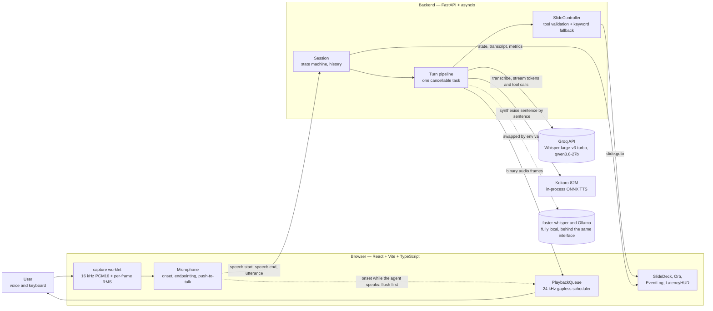

# Dynamic Voice Deck

A voice-first AI slide presenter. Ask it a question out loud and it answers, moves the deck to the
slide that holds the answer, and stops talking the moment you start.

The deck it presents is its own architecture, so the fastest way to understand the system is to
interrupt it and ask.

<!--
  MAINTAINER: record a 20-second GIF here showing: start a session, ask "how do you handle
  interruptions?", the deck moves to slide 4 as the answer begins, then talk over it and watch the
  audio stop and the HUD show the stop time. Until that exists this section stays honest and empty
  rather than shipping a broken image link.
-->

---

## What it does

- **Talk to it.** Speech detection runs in the browser; 600 ms of silence ends your turn and the
  finished utterance is transcribed in one request.
- **It moves the deck itself.** The model calls `go_to_slide(index, reason)`; the reason appears in
  the event log, so every move is attributable. A server-side keyword fallback catches the turns
  where the model answers correctly but forgets to call the tool.
- **Interrupt it.** Start talking and the sound stops in under 150 ms. The agent's memory is then
  cut to the sentences you actually heard, so it never refers back to something it never said.
- **Or let it present.** "Walk me through it" reads the whole deck from its own speaker notes, with
  no model calls at all. Interrupt that too; "carry on" resumes where it stopped.
- **Or type.** Every question works from the text box, so a refused microphone or a noisy room is
  an inconvenience rather than a wall. Push-to-talk is there for the same reason.
- **Watch it work.** The event log shows every state change, tool call, transcript and metric, and
  exports as JSON. The latency panel shows what each stage of the last turn cost.

---

## Quick start

**Prerequisites**

| Requirement    | Notes                                                                                                    |
| -------------- | -------------------------------------------------------------------------------------------------------- |
| Python 3.12    | Installed and managed by [`uv`](https://docs.astral.sh/uv/); `backend/.python-version` pins the version. |
| Node.js 20+    | With npm 10+.                                                                                            |
| A Groq API key | Free, no card required — sign up at [console.groq.com](https://console.groq.com) and create a key.       |

```bash
git clone https://github.com/<owner>/dynamic-voice-deck.git
cd dynamic-voice-deck
cp .env.example .env     # then open .env and paste your key into GROQ_API_KEY=
make setup               # uv sync (backend) + npm install (frontend)
```

Then either run the two development servers in two terminals:

```bash
make backend             # FastAPI on http://localhost:8000
make frontend            # Vite on http://localhost:5173, proxying the API
```

…or build once and run the whole thing as a single process:

```bash
make serve               # builds the frontend, then serves app and API on :8000
```

Open the page, click **Start session**, and allow the microphone. Ask it something.

**Headphones help.** The browser's echo cancellation is good but not perfect, and on loud speakers
the agent can hear itself and stop mid-sentence. Onset needs three consecutive loud frames while
the agent is speaking for exactly this reason, but headphones remove the problem entirely.

The first run downloads the Kokoro voice (about 330 MB) into `backend/models/`. It is checked
against a known SHA-256 and never committed.

---

## Architecture

The voice loop is an explicit **STT → LLM → TTS pipeline built from open-weight models**, not a
closed speech-to-speech API. That choice is the whole point: turn-taking, endpointing, barge-in and
history truncation are implemented in this repository, so they can be read, tested and tuned rather
than being properties of somebody else's endpoint.

The browser owns everything that has to react instantly. An AudioWorklet downmixes the microphone,
resamples to 16 kHz and reports the loudness of every 32 ms frame; the main thread decides from
those numbers when you started and stopped talking. Detecting that you have started costs no
network hop, which is what makes interruption feel immediate. Finished utterances go to the backend
over one WebSocket; audio comes back as binary frames that a playback queue schedules gaplessly.

The backend owns session state. One `Session` per socket holds the state machine, the conversation
history and exactly one in-flight pipeline `asyncio.Task`. That task transcribes the utterance,
streams model tokens with `go_to_slide` bound as a tool, splits the stream into sentences so speech
can start before the answer is finished, and synthesises each sentence with Kokoro. Because a whole
turn is one cancellable task, interrupting the agent is a `task.cancel()` that propagates into the
open HTTP streams.



Container, component and sequence diagrams are in `docs/TRD.md` §2, and the WebSocket protocol is
defined once in `backend/app/protocol.py` and mirrored in `frontend/src/protocol.ts`, with a test
that fails if the two ever disagree.

---

## How interruption works

Barge-in is two tiers, because the tier the listener feels must never wait for the network.

**Tier one is the browser.** When speech onset is detected while the agent is speaking, the
playback queue is flushed immediately — every scheduled buffer is stopped and dropped — and only
then is an `interrupt` message sent, carrying the id of the last sentence that actually finished
playing. Measured locally, the flush takes under a millisecond.

**Tier two is the server.** The session cancels the in-flight pipeline task. `CancelledError`
propagates into the open model stream and the synthesis queue, and the conversation history for
that turn is rewritten to the sentences the listener genuinely heard, ending with an
`[interrupted by user]` marker. Measured against real providers, `agent.cancelled` comes back
**1.9 ms** after the interrupt leaves the client, with **zero** audio frames sent afterwards.

The number that explains why both tiers exist is this: at the moment of a cut, the browser was
holding **2.6 seconds** of audio it had not yet played. The server streams synthesis faster than
the room can hear it, so a design that cancelled only server-side would have kept talking for
another two and a half seconds. The server stopping in 1.9 ms is not what makes the agent go quiet;
the browser is.

The truncation is why the agent does not later refer to something it never said, and it is why a
turn is a single cancellable task rather than a chain of independent coroutines.

---

## Measured latency

Every number below came from the metrics pipeline on this machine, against the real providers
(`qwen/qwen3.8-27b` on Groq, Whisper large-v3-turbo, Kokoro-82M on CPU). Nothing here is a budget.

| Path                               | Measured       | Budget       | Where it comes from                   |
| ---------------------------------- | -------------- | ------------ | ------------------------------------- |
| Question asked → first audio frame | **777 ms**     | ≤ 1,500 ms   | `TC-INT-005`, `make test-integration` |
| Model time to first token          | 700 ms – 2.3 s | ≤ 600 ms p95 | `llm_ttft_ms`, the dominant cost      |
| Synthesis, first chunk             | ~340 ms        | ≤ 500 ms     | `tts_ttfb_ms`                         |
| Transcription, one utterance       | ~265 ms        | ≤ 700 ms     | `stt_ms`                              |
| Interrupt → `agent.cancelled`      | **1.9 ms**     | ≤ 50 ms      | live WebSocket probe                  |
| Interrupt → audio stops            | < 1 ms         | ≤ 150 ms     | `PlaybackQueue.flush`, client-side    |
| Walkthrough → first audio          | **202 ms**     | —            | no model call is involved             |

The honest reading: the product is comfortably inside its first-audio budget, and the only stage
that ever exceeds its own budget is the model's first token on a free tier. Everything this
repository controls is fast; the variable is the hosted model.

For comparison, the same question through `openai/gpt-oss-120b` takes **2,066 ms** to first audio,
because it is a reasoning model and spends its token allowance thinking before it says anything.
That is why the default is Qwen. See `docs/EVALS.md`.

---

## Evals

Unit tests check the code; evals check the **agent**, whose behaviour is a property of a model and
therefore not deterministic. Six suites live in `backend/evals/`, run with `make evals`, and their
results are recorded in [`docs/EVALS.md`](docs/EVALS.md) with the git SHA of the commit they
describe.

| Suite                  | What it asks                                                                                                                                  | Threshold                                |
| ---------------------- | --------------------------------------------------------------------------------------------------------------------------------------------- | ---------------------------------------- |
| E1 Slide routing       | Does it land on the right slide, and stay put when it should? 40 utterances across paraphrase, relative, cross-reference, stay and off-topic. | accuracy ≥ 90 %, false navigation ≤ 5 %  |
| E2 Interruption memory | After being cut off, does it avoid repeating what was heard and avoid referring to what was never said? 16 scripted interruptions.            | repetition ≤ 10 %, phantom reference 0 % |
| E3 Groundedness        | Are answers faithful to the speaker notes, and are unanswerable questions declined? 31 questions, 5 of them unanswerable.                     | mean ≥ 1.7 / 2, decline ≥ 80 %           |
| E4 Spoken style        | Is the output speakable: short, no markdown, no URLs, no emoji? Derived from every answer E1–E3 produced.                                     | pass ≥ 95 %                              |
| E5 Latency             | Stage latencies with real synthesis, three live turns.                                                                                        | within the budgets above                 |
| E6 Tool-call hygiene   | Are tool calls valid, and kept away from off-topic input? Derived from the E1 traces.                                                         | 0 invalid, ≤ 5 % on off-topic            |

E2 and E3 are graded by the same model family at `temperature=0` against written rubrics in
`backend/evals/judges/`. The judge is itself checked on every run against ten hand-labelled items;
if it agrees with fewer than nine of them, the run says so and its judged numbers are not believed.

Evals are opt-in because they spend real quota: a full run is roughly a hundred model calls at
about 2,900 input tokens each, against a free-tier ceiling of 200,000 tokens per model per day. A
full run is therefore about a third of a day's budget for one model.

**What has been run so far.** `openai/gpt-oss-120b` scored **58.3 %** on routing (24 of 40 items
answered; the rest were refused by the free tier and excluded rather than counted wrong), with zero
false navigation and two invalid tool calls. Seven of the eight paraphrased questions it answered
produced no visible text at all — the reasoning-model failure mode, where the token allowance goes
on hidden reasoning before anything is said. That is the numeric version of why the default is
Qwen. The default model's own run is still pending: the day's budget for it was spent on building
and verifying the thing. Both runs, including the one that measured nothing, are recorded in
[`docs/EVALS.md`](docs/EVALS.md).

---

## Trade-offs and next steps

**A pipeline instead of a speech-to-speech API.** A speech-to-speech model would be faster and
would include barge-in for free. It would also hide the thing this project is about. Every decision
in the turn-taking loop — how much silence ends a turn, what counts as a misfire, what the agent is
allowed to remember after being interrupted — is a line of code here rather than a property of an
endpoint. The cost is latency: roughly 800 ms to first sound instead of a few hundred.

**Open weights on hosted inference, not local-only.** Whisper, Qwen and Kokoro are all open-weight,
and each provider slot has a local implementation behind the same `Protocol`. The default runs
Whisper and Qwen on Groq because it is fast and free, and Kokoro in-process because it is small
enough to be. The cost is that the model is the slowest stage and the free tier's ceiling is
reachable in normal use — four questions in two minutes is enough.

**So the model has a local understudy.** Set `LLM_FALLBACK_PROVIDER=ollama` and a rate-limited turn
is answered by `qwen2.5:7b` running on your own machine instead of failing, with a banner naming
both models. It is four to six times slower to first token, and it routes less well: 57.5 % against
the hosted model on E1. It is kept anyway because of _how_ it fails — it answers the question and
leaves the deck where it was, rather than going silent. Degrading is a feature; dying is not. The
numbers are in [`docs/EVALS.md`](docs/EVALS.md), and it is off by default because it needs Ollama
installed and a 4.7 GB model pulled.

**Detection in the browser, transcription per utterance.** Interruption is detected locally and
needs no round trip, which is what makes it feel instant. The cost is that transcription cannot
start until you stop talking, so the pipeline is strictly serial. Streaming STT would overlap them.

**An energy threshold, not a neural detector.** The design specified Silero VAD. It could not be
made to load under Vite, in four distinct ways, each verified in a real browser and recorded in the
engineering log. The replacement is an energy threshold with hysteresis: adequate for "has this
person started talking", with echo cancellation doing most of the work, and materially worse in a
noisy room. It is one file, and the timings around it are unchanged, so swapping a neural detector
back in changes nothing else.

**It still is not an offline mode.** The local understudy covers the model; speech-to-text is
hosted. `STT_PROVIDER=local` is designed and unbuilt, and until it exists the microphone
path needs the network even when the model does not.

**Next, with another week.** The local speech-to-text provider, which is what would make the whole
thing run with no network at all. Streaming transcription, to overlap the two serial stages. Deck
generation from a topic, which is designed (PRD F14) and not built. And a second voice, because one
of the clearest signals in testing was how much the voice shapes whether people interrupt at all.

---

## Project structure

```
dynamic-voice-deck/
├── Makefile                   # every development command
├── .env.example               # every environment variable, documented
├── CLAUDE.md                  # engineering standards
├── docs/                      # PRD, TRD, test cases, evals, engineering log
├── backend/
│   ├── app/
│   │   ├── main.py            # FastAPI app, routes, lifespan, static mount
│   │   ├── config.py          # pydantic-settings Settings
│   │   ├── protocol.py        # WebSocket message models (source of truth)
│   │   ├── session.py         # Session, state machine, orchestration
│   │   ├── pipeline/          # turn, chunker, history, slides, prompt, metrics
│   │   ├── providers/         # STT / LLM / TTS protocols and implementations
│   │   ├── decks/             # Deck and Slide models, the deck itself
│   │   └── prompts/           # presenter system prompt
│   ├── tests/                 # pytest: unit, contract, integration
│   ├── evals/                 # eval suites, datasets, judges, runner
│   └── scripts/               # fixture generation
└── frontend/
    ├── src/
    │   ├── protocol.ts        # mirror of backend/app/protocol.py
    │   ├── audio/             # microphone, playback queue
    │   ├── session/           # SessionClient, useSession, push-to-talk
    │   ├── components/        # SlideDeck, Orb, EventLog, LatencyHUD, Controls
    │   └── store.ts           # zustand session state
    ├── public/worklets/       # the capture AudioWorklet
    └── e2e/                   # Playwright specs against fake providers
```

---

## Development

All commands run from the repository root.

| Target                  | What it does                                                                                 |
| ----------------------- | -------------------------------------------------------------------------------------------- |
| `make setup`            | Install backend dependencies with `uv sync` and frontend dependencies with `npm install`.    |
| `make backend`          | FastAPI with auto-reload on port 8000.                                                       |
| `make frontend`         | Vite dev server on port 5173, proxying `/api` and `/ws`.                                     |
| `make build`            | Build the frontend into `frontend/dist/`.                                                    |
| `make serve`            | Build, then serve the app and the API from one process on port 8000.                         |
| `make lint`             | Backend `ruff check`, `ruff format --check` and `mypy`; frontend ESLint, `tsc` and Prettier. |
| `make format`           | Apply `ruff format`, `ruff check --fix`, Prettier and `eslint --fix`.                        |
| `make test`             | Unit and contract tests. Needs no network and no API key.                                    |
| `make test-integration` | Tests that call the real Groq API and load the real Kokoro weights. Needs `GROQ_API_KEY`.    |
| `make test-e2e`         | Playwright against a backend with fake providers. Stop `make backend` first.                 |
| `make evals`            | Agent eval suites. Spends free-tier quota; `SUITE=E1 MODEL=<id>` narrows a run.              |
| `make clean`            | Remove caches, coverage output and `frontend/dist`.                                          |

Read `CLAUDE.md` before your first change: it fixes the Python and TypeScript standards, the async
and cancellation rules that barge-in depends on, and the requirement that every behavioural change
updates `docs/TEST_CASES.md` and `docs/ENGINEERING_LOG.md` in the same commit.

---

## Documentation

| Document                                             | What it is for                                                                  |
| ---------------------------------------------------- | ------------------------------------------------------------------------------- |
| [`docs/PRD.md`](docs/PRD.md)                         | Product behaviour: the deck, features F1–F14, acceptance criteria, milestones.  |
| [`docs/TRD.md`](docs/TRD.md)                         | Architecture, component contracts, the WebSocket protocol, requirements TR-xxx. |
| [`docs/TEST_CASES.md`](docs/TEST_CASES.md)           | Living catalogue of test cases with current status.                             |
| [`docs/EVALS.md`](docs/EVALS.md)                     | Eval suite design and the recorded results for each release.                    |
| [`docs/ENGINEERING_LOG.md`](docs/ENGINEERING_LOG.md) | Dated record of every change, the reasoning, and the dead ends.                 |
| [`CLAUDE.md`](CLAUDE.md)                             | Engineering standards: style, typing, async rules, testing, definition of done. |

---

## License

Released under the MIT License.
