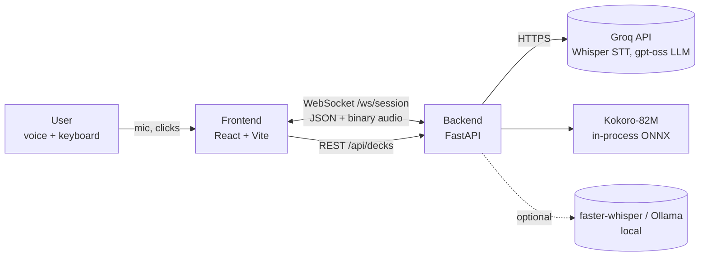
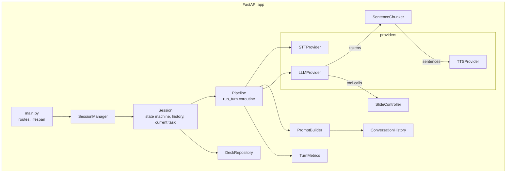
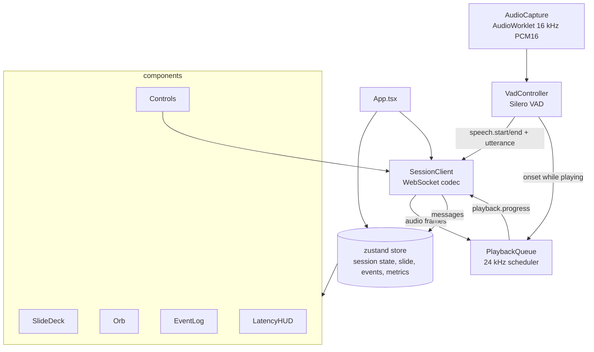
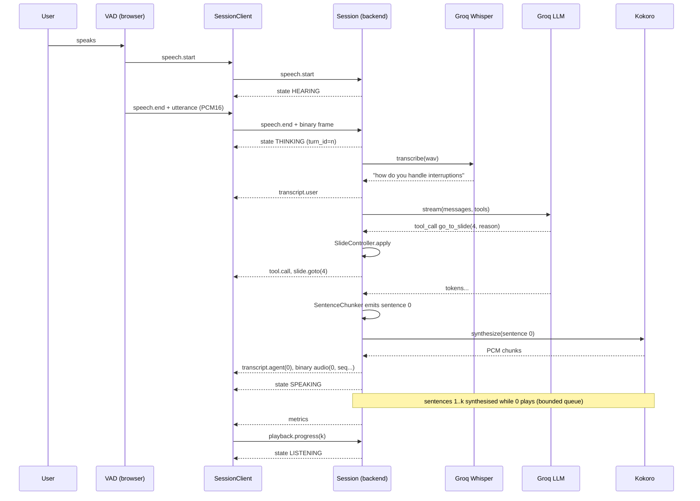
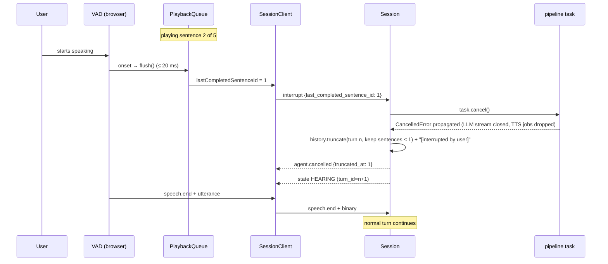

# Dynamic Voice Deck — Technical Requirements Document

| Field | Value |
|---|---|
| Project | Dynamic Voice Deck |
| Owner | Harshvardhan |
| Target release | v0.1.0 — 11 September 2026 |
| Related docs | `docs/PRD.md` (what and why), `docs/TEST_CASES.md`, `docs/EVALS.md`, `docs/ENGINEERING_LOG.md` |
| Status | Draft v1.0 — 9 September 2026 |

This document specifies **how** the product described in the PRD is built: architecture, component contracts, protocol, data models, performance budgets, failure handling, testing, and evaluation. Requirement IDs (`TR-xxx`) are referenced from test cases and the engineering log.

---

## 1. Scope and constraints

| ID | Requirement |
|---|---|
| TR-001 | The system runs locally with two processes: a FastAPI backend and a Vite dev server (or static build) for the frontend. |
| TR-002 | All ML models are open weight. Hosted inference (Groq) is used by default; each provider slot has a local implementation behind the same interface. |
| TR-003 | No cloud deployment, database, or authentication in v0.1.0. |
| TR-004 | Target platforms: macOS and Linux for the backend; Chrome/Edge latest for the frontend; Safari best-effort. |
| TR-005 | Audio is processed in memory only and is never written to disk or logged. |
| TR-006 | A fresh clone must reach a running app in ≤ 5 commands documented in the README. |

---

## 2. Architecture overview

### 2.1 System context



### 2.2 Container view

| Container | Tech | Responsibilities |
|---|---|---|
| **Frontend** | React 19, TypeScript 6, Vite 8, Web Audio API (AudioWorklet capture and playback), zustand. No ML dependency in the browser (see TR-110). | Capture and resample mic audio; detect speech on-device; render slides; play streamed audio gaplessly; execute client tier of barge-in; display state, transcript, metrics. |
| **Backend** | Python 3.12, FastAPI, uvicorn, asyncio, httpx, pydantic v2, pydantic-settings, `groq` SDK, `kokoro-onnx`, numpy | Own session state machine and conversation history; run the STT→LLM→TTS pipeline as a cancellable task; validate and apply slide tool calls; stream audio; emit metrics. |
| **Providers (external)** | Groq REST API | Whisper large-v3-turbo transcription; `openai/gpt-oss-120b` chat completions with tools and streaming. |

### 2.3 Component view — backend



### 2.4 Component view — frontend



### 2.5 Primary sequence — a voice turn with slide navigation



### 2.6 Primary sequence — barge-in



---

## 3. Runtime environment

| ID | Requirement |
|---|---|
| TR-010 | Backend targets **Python 3.12** managed by `uv` (`.python-version` in `backend/`). Reason: `onnxruntime` wheels for 3.13+ lag; the dev machine has 3.14. **Verified 2026-09-10:** `kokoro-onnx` 0.6.1, `onnxruntime` 1.29.0 (CoreML + CPU providers), `numpy` 2.5.3 install cleanly on Python 3.12 arm64. |
| TR-011 | Frontend targets **Node 20 LTS**; `package.json` declares `"engines": {"node": ">=20"}`. |
| TR-012 | Kokoro weights (`kokoro-v1.0.onnx` ≈ 310 MB, `voices-v1.0.bin` ≈ 27 MB) are downloaded on first backend start into `backend/models/` with a progress log and SHA-256 check; never committed. |
| TR-013 | Backend memory at steady state ≤ 1.5 GB; startup ≤ 10 s including a warm-up synthesis. |
| TR-014 | Configuration via `.env` at repo root, parsed by `pydantic-settings`; every variable documented in `.env.example`. |

### 3.1 Backend dependencies (pinned in `pyproject.toml`)

| Package | Purpose |
|---|---|
| `fastapi`, `uvicorn[standard]` | HTTP + WebSocket server (uvloop, websockets) |
| `pydantic>=2`, `pydantic-settings` | Models, protocol, config |
| `httpx` | Async HTTP for Groq streaming (used directly for fine control of cancellation) and Ollama |
| `groq` | Official SDK for Whisper transcription |
| `kokoro-onnx`, `onnxruntime`, `numpy` | TTS |
| `soundfile` | In-memory WAV encoding for STT upload |
| `structlog` | Structured logging |
| dev: `ruff`, `pytest`, `pytest-asyncio`, `pytest-cov`, `mypy`, `hypothesis` | Quality |
| optional: `faster-whisper` | Local STT (`uv sync --extra local`) |

### 3.2 Frontend dependencies

| Package | Purpose |
|---|---|
| `react`, `react-dom` (19.x) | UI |
| `zustand` | Store |
| *(none)* | Speech detection is an audio worklet in this repository; see TR-110 |
| dev: `vite` 8, `typescript` 6, `eslint` 10 + `typescript-eslint` 8 (type-checked rules), `prettier`, `vitest` 4, `@testing-library/react`, `playwright` | Build and test. The Vite template's default linter (`oxlint`) is removed in favour of typescript-eslint because type-aware rules (`no-floating-promises`, `no-misused-promises`, `await-thenable`) directly guard the async audio and WebSocket code. |

---

## 4. Backend design

### 4.1 Module layout and responsibilities

```
backend/app/
├── main.py            FastAPI factory, lifespan (load deck repo, warm providers), routes
├── config.py          Settings (pydantic-settings)
├── errors.py          AppError hierarchy
├── logging_setup.py   configure_logging() + get_logger(); structlog with the stdlib bridge
├── protocol.py        Client/Server message models, MessageType enum, binary framing helpers
├── session.py         Session, SessionState, SessionManager
├── pipeline/
│   ├── turn.py        run_turn(): STT → LLM → chunker → TTS orchestration
│   ├── chunker.py     SentenceChunker
│   ├── history.py     ConversationHistory (messages, truncation, capping)
│   ├── slides.py      SlideController (tool validation, keyword fallback, cursor)
│   ├── prompt.py      PromptBuilder (system prompt from template + deck + state)
│   └── metrics.py     TurnMetrics
├── providers/
│   ├── base.py        STTProvider / LLMProvider / TTSProvider Protocols + shared types
│   ├── groq_stt.py    GroqWhisperSTT
│   ├── groq_llm.py    GroqLLM (httpx streaming SSE, tool-call assembly)
│   ├── kokoro_tts.py  KokoroTTS (thread-pool synthesis, chunked yield)
│   ├── local_stt.py   FasterWhisperSTT (optional extra)
│   ├── ollama_llm.py  OllamaLLM
│   └── registry.py    build_providers(settings) -> Providers
├── decks/
│   ├── models.py      Deck, Slide (pydantic)
│   ├── repository.py  DeckRepository (load/validate JSON, list, get)
│   └── anatomy_of_a_voice_agent.json
└── prompts/
    └── presenter.md   System prompt template (Jinja-free f-string placeholders)
```

### 4.2 Key types

```python
# providers/base.py
class Transcript(BaseModel):
    text: str
    latency_ms: int
    language: str | None = None

class TokenDelta(BaseModel):
    text: str

class ToolCallDelta(BaseModel):
    call_id: str
    name: str
    arguments: dict[str, Any]

class LLMDone(BaseModel):
    finish_reason: Literal["stop", "tool_calls", "length", "cancelled"]

LLMEvent = TokenDelta | ToolCallDelta | LLMDone

class STTProvider(Protocol):
    name: str
    async def transcribe(self, pcm16: bytes, sample_rate: int = 16_000) -> Transcript: ...

class LLMProvider(Protocol):
    name: str
    def stream(self, messages: list[Message], tools: list[ToolSpec]) -> AsyncIterator[LLMEvent]: ...

class TTSProvider(Protocol):
    name: str
    sample_rate: int  # 24_000 for Kokoro
    def synthesize(self, text: str, voice: str) -> AsyncIterator[bytes]: ...  # PCM16 LE chunks
    async def warm_up(self) -> None: ...
```

```python
# session.py
class SessionState(StrEnum):
    IDLE = "idle"; CONNECTING = "connecting"; LISTENING = "listening"; HEARING = "hearing"
    THINKING = "thinking"; SPEAKING = "speaking"; INTERRUPTED = "interrupted"; ERROR = "error"

@dataclass
class Session:
    id: str
    ws: WebSocket
    deck: Deck
    providers: Providers
    history: ConversationHistory
    slides: SlideController          # current_slide, presentation_cursor, mode
    state: SessionState = SessionState.CONNECTING
    turn_id: int = 0
    task: asyncio.Task[None] | None = None
    pending_utterance: bytes | None = None
    last_interrupt_ts: float = 0.0
```

### 4.3 Session state machine

| ID | Requirement |
|---|---|
| TR-020 | States and transitions exactly as PRD §7. Every transition emits `state {value, turn_id, server_ts}`. |
| TR-021 | `turn_id` increments when a new pipeline task starts. Clients discard `transcript.agent`, audio, and `metrics` whose `turn_id` is older than the latest `state` they received. |
| TR-022 | At most one pipeline task per session. `Session.start_turn()` cancels and awaits the previous task before creating a new one. |
| TR-023 | `speech.start` received in THINKING or SPEAKING is treated as `interrupt` with `last_completed_sentence_id` taken from the most recent `playback.progress` (client may follow with an explicit `interrupt` carrying a more precise value; the later value wins if it arrives within 200 ms). |
| TR-024 | `interrupt` received in LISTENING or HEARING is a no-op. Two interrupts within 500 ms are idempotent. |
| TR-025 | A watchdog (`asyncio.timeout(20)`) wraps each turn. On expiry: cancel task, emit `error {code: "turn_timeout", recoverable: true}`, state → LISTENING. |
| TR-026 | On WebSocket disconnect: cancel task, release resources, remove session. Session objects must not outlive the socket. |

### 4.4 Turn pipeline (`pipeline/turn.py`)

```
run_turn(session, *, utterance: bytes | None, text: str | None, source: "voice"|"text")
  1. metrics.start()
  2. if utterance: transcript = await stt.transcribe(utterance)          → metrics.stt_ms
       if transcript is empty or in FILLER_DENYLIST: emit state LISTENING; return
       emit transcript.user
     else: transcript.text = text
  3. history.add_user(transcript.text)
  4. messages = prompt_builder.build(history, deck, slides.snapshot())
  5. chunker = SentenceChunker(); tts_queue = asyncio.Queue(maxsize=2)
     sender = create_task(_tts_sender(tts_queue))       # synthesises + sends in order
  6. async for ev in llm.stream(messages, TOOLS):
       ToolCallDelta → slides.apply_tool(ev) → emit tool.call, slide.goto; history.add_tool_call/result
       TokenDelta    → for sentence in chunker.feed(ev.text): await tts_queue.put(sentence)   (first token → metrics.llm_ttft_ms)
       LLMDone       → for sentence in chunker.flush(): put; break
  7. await tts_queue.put(END); await sender
  8. if no tool call and slides.keyword_fallback(full_text) → emit tool.call(source="fallback"), slide.goto
  9. history.add_assistant(full_text, sentences)
 10. emit metrics
 (state → LISTENING is driven by the client's final playback.progress, with a 3 s safety timer)
```

| ID | Requirement |
|---|---|
| TR-030 | STT input is a 16 kHz mono PCM16 WAV built in memory with `soundfile`; requests time out at 10 s; one retry after 500 ms on 429/5xx. |
| TR-031 | LLM streaming uses `httpx.AsyncClient.stream` against the OpenAI-compatible Groq endpoint so that cancelling the task closes the HTTP stream immediately. Tool-call argument fragments are accumulated per `call_id` and parsed when complete. |
| TR-032 | Multiple tool calls in one response are applied in order; the last `go_to_slide` wins for the on-screen slide. |
| TR-033 | The `_tts_sender` task synthesises sentences strictly in order and sends `transcript.agent` immediately before the first audio frame of each sentence. |
| TR-034 | Cancellation: cancelling the turn task cancels `_tts_sender`; both swallow `CancelledError` only after cleanup, then re-raise. Unsent audio is discarded. |
| TR-035 | `first token` and `first audio` timestamps use `time.perf_counter()`; metrics are integers in milliseconds. |

### 4.5 SentenceChunker (`pipeline/chunker.py`)

| ID | Requirement |
|---|---|
| TR-040 | `feed(text) -> list[str]` returns zero or more complete segments; `flush() -> list[str]` returns the remainder. |
| TR-041 | A segment ends at `.`, `!`, `?` followed by whitespace or end, **unless** the terminator is part of a known abbreviation (`e.g.`, `i.e.`, `Dr.`, `vs.`) or a decimal number (`3.5`). |
| TR-042 | If the buffer exceeds 60 characters and contains `,`, `;`, `:` or ` — `, split at the last such boundary (early first audio). |
| TR-043 | If the buffer exceeds 200 characters with no boundary, split at the last whitespace. |
| TR-044 | Segments are stripped and never empty; markdown symbols (`*`, `#`, backticks) are removed before TTS. |
| TR-045 | Segment IDs (`sentence_id`) start at 0 per turn and increment by one. |

### 4.6 ConversationHistory (`pipeline/history.py`)

| ID | Requirement |
|---|---|
| TR-050 | Message model: `role: system|user|assistant|tool`, `content: str`, optional `tool_calls`, `tool_call_id`, and for assistant messages `sentences: list[str]` (the segments as spoken). |
| TR-051 | `truncate_current(turn_id, last_completed_sentence_id)` replaces the in-progress assistant content with `" ".join(sentences[: last_completed + 1]) + " [interrupted by user]"`. If `last_completed_sentence_id is None`, content becomes `"[interrupted by user before speaking]"`. Tool calls already applied in that turn are retained. |
| TR-052 | History keeps the system message plus the most recent 20 user/assistant pairs; older messages are dropped oldest-first. Tool messages are dropped together with their parent assistant message. |
| TR-053 | `add_system_note(text)` appends a `system` message such as `"[User manually moved to slide 4: Barge-in]"`. |
| TR-054 | `to_provider_messages()` serialises to the OpenAI chat format; the `sentences` field is internal and never sent. |

### 4.7 SlideController (`pipeline/slides.py`)

| ID | Requirement |
|---|---|
| TR-060 | Holds `current_slide: int` (1-based), `presentation_cursor: int`, `mode: qa|present`, and the `Deck`. |
| TR-061 | `apply_tool(call) -> SlideAction | None` validates: known tool name, `slide_index` within `1..len(deck.slides)`, `bullet_index` within the current slide. Invalid calls are logged and return a `tool` message with an error string so the model can self-correct; they never raise. |
| TR-062 | `keyword_fallback(answer_text) -> SlideAction | None` tokenises the answer, scores each slide by weighted alias hits (exact alias phrase = 3, title word = 2, bullet word = 1), and returns the top slide if its score ≥ 4 and it beats the runner-up by ≥ 2 and it differs from `current_slide`. |
| TR-063 | `on_user_navigation(index)` updates `current_slide` and returns a system note string. Does not change `presentation_cursor`. |
| TR-064 | `advance_cursor()` moves the cursor forward in `present` mode; `snapshot()` returns a small dict injected into the prompt. |

### 4.8 PromptBuilder (`pipeline/prompt.py`)

| ID | Requirement |
|---|---|
| TR-070 | The template `prompts/presenter.md` has placeholders `{deck_json}`, `{current_slide}`, `{presentation_cursor}`, `{mode}`; rendering is a plain `str.format` with a `SafeDict` so stray braces in deck text cannot raise. |
| TR-071 | Deck JSON in the prompt includes index, title, bullets, speaker notes, aliases; per-slide notes are capped at 600 characters. |
| TR-072 | The tool schemas are constants in `pipeline/tools.py` and mirrored verbatim in PRD §F5. |

### 4.9 Providers

| ID | Requirement |
|---|---|
| TR-080 | `registry.build_providers(settings)` instantiates implementations from `STT_PROVIDER`, `LLM_PROVIDER`, `TTS_PROVIDER`; unknown values fail fast at startup with a clear message. |
| TR-081 | `GroqWhisperSTT`: model from `GROQ_STT_MODEL`, `response_format="verbose_json"`, `language="en"`, `temperature=0`. |
| TR-082 | `GroqLLM`: model from `GROQ_LLM_MODEL`, `temperature=0.4`, `max_tokens=350`, `tool_choice="auto"`, `stream=True`. Parses SSE lines; yields `TokenDelta` / `ToolCallDelta` / `LLMDone`. |
| TR-083 | `KokoroTTS`: loads the model at startup. **API fact (verified 2026-09-10):** `Kokoro.create(text, voice, speed=1.0, lang="en-us", ...) -> (NDArray[float32], sample_rate)` synthesises a whole utterance and returns it in one array; it is **not** an incremental generator. `synthesize` therefore runs `create()` in a thread executor, converts float32 to PCM16, and yields ~100 ms chunks (2,400 samples at 24 kHz) for transmission. Intra-sentence streaming is not available; low time-to-first-audio comes from the `SentenceChunker` splitting early (TR-042), not from streaming inside a sentence. Speed from `KOKORO_SPEED`, voice from `KOKORO_VOICE`. |
| TR-088 | **Added 2026-09-11.** A spoken segment that *begins* with prompt scaffolding -- the interruption marker, or the stamp naming the slide on screen -- has that prefix stripped before synthesis. Anchored to the start deliberately: slide 4's own bullet quotes the marker and its notes explain it, so an answer *about* it must stay speakable, while an answer that opens by reciting it is a model continuing its own history rather than answering. **Extended 2026-09-11 (release eval).** Labels the model leaks from its own chat template -- "assistant reasoning", "assistant turn N" with or without a JSON wrapper around the answer, and the whole-segment "assistant turn failed before producing text" -- are scaffolding of a third kind and are stripped the same way. A bare label is stripped only when a fresh capitalised sentence follows it, so a sentence that merely begins with those words is left alone. |
| TR-091 | **Added 2026-09-11.** `KokoroTTS._load` refuses to start when the phonemiser's data path exceeds 150 characters, with a message naming the path and the fix. espeak-ng keeps that path in a fixed-size buffer and, when it does not fit, prints one line to stderr and calls `exit(1)`: the server disappears with no Python traceback. Observed on a checkout 193 characters deep and not on one at 105; a fresh clone at 82 worked. The guard converts a vanished process into a sentence. |
| TR-090 | **Added 2026-09-11.** An `interrupt` naming the current turn is honoured while the room is still hearing that turn, even once generation has finished and the session has returned to LISTENING. Synthesis is streamed several seconds faster than it can be heard, so a turn is routinely over on the server while the listener is mid-sentence; a cut then must still truncate history and emit `agent.cancelled`, or the agent believes it said sentences nobody received. The session tracks `_playing`, cleared when the client reports playback progress for the turn's final sentence, so a message arriving after an answer was genuinely heard in full still changes nothing (TR-024). |
| TR-089 | **Added 2026-09-11.** A transcript in the filler denylist is recognised in `Session.handle_utterance`, before `start_turn`. Recognising it inside `run_turn` meant the cancellation had already happened: a cough during an answer destroyed that answer and replaced it with nothing. The session also keeps the floor rather than announcing LISTENING when a turn is still speaking. |
| TR-087 | **Added 2026-09-11.** `Slide.figure` declares an arrangement (`metrics`, `split`, `flow`) as a list of items, each naming the bullet indices it presents. A model validator rejects any figure whose items do not cover every bullet exactly once, which is what stops the screen and the prompt drifting apart and what keeps `highlight_bullet` working across arrangements. The frontend falls back to a plain list for an absent or unrecognised kind, so a deck authored against a newer schema renders less prettily rather than not at all. |
| TR-086 | **Added 2026-09-11, widened the same day.** A tool call the model wrote as prose instead of making is cut from speech. Three shapes, each observed from a real model: any tool name followed by an opening bracket (`go to slide(4, "...")`, `highlightbullet(1)`); the code-style name with a bare argument (`go_to_slide 4`, `highlight_bullet 3`), since underscores never occur in speech; and `highlight bullet 2` with neither, which no presenter says. `go to slide 4` as plain words is deliberately left alone, because "let's go to slide four" is real speech. The segment is cut at the call rather than dropped, because the model almost always types the call *after* finishing its sentence, and the sentence is the answer. Slide 5 names both tools without a bracket or a number and stays speakable. |
| TR-085 | **Added 2026-09-11.** `LLM_FALLBACK_PROVIDER` names a second model to answer with when the first is rate limited. The wrapper switches only for a rate limit (a retryable error carrying a retry-after) and only before the primary has emitted anything, because half a spoken answer cannot be restarted elsewhere without repeating it. The switch is reported through the model stream as `ProviderSwitched`, the pipeline turns it into a `provider.fallback` message, and the UI names both models and says when the hosted one is expected back. The banner is scoped to the turn it explains: a later turn that completes without announcing a substitution clears it, so it never claims a substitution that has ended. Off by default: it needs a local model pulled. |
| TR-089 | **Added 2026-09-11.** A transcript in the filler denylist is recognised in `Session.handle_utterance`, before `start_turn`. Recognising it inside `run_turn` meant the cancellation had already happened: a cough during an answer destroyed that answer and replaced it with nothing. The session also keeps the floor rather than announcing LISTENING when a turn is still speaking. |
| TR-087 | **Added 2026-09-11.** `Slide.figure` declares an arrangement (`metrics`, `split`, `flow`) as a list of items, each naming the bullet indices it presents. A model validator rejects any figure whose items do not cover every bullet exactly once, which is what stops the screen and the prompt drifting apart and what keeps `highlight_bullet` working across arrangements. The frontend falls back to a plain list for an absent or unrecognised kind, so a deck authored against a newer schema renders less prettily rather than not at all. |
| TR-086 | **Added 2026-09-11.** A segment matching a tool call written as prose -- a tool name followed by an opening bracket -- is dropped rather than spoken. Smaller models sometimes write the call instead of making it; the prompt asks them not to, and this makes it true. Matching requires the bracket, so an answer that merely names a tool, as slide 5 does, is unaffected. |
| TR-084 | `FasterWhisperSTT` (optional): `large-v3-turbo` int8 on CPU; `OllamaLLM`: OpenAI-compatible endpoint at `OLLAMA_BASE_URL` with the same streaming parser as Groq. |
| TR-085 | Every provider raises `ProviderError(provider, message, retryable)`; no vendor exception escapes `providers/`. |

### 4.10 HTTP API

| Method | Path | Response |
|---|---|---|
| GET | `/api/health` | `{status: "ok", version: str, providers: {stt, llm, tts}, tts_warm: bool}` |
| GET | `/api/decks` | `[{id, title, slide_count}]` |
| GET | `/api/decks/{id}` | `Deck` JSON; 404 if unknown |
| WS | `/ws/session` | Protocol §6 |

CORS allows `http://localhost:5173` and `http://127.0.0.1:5173` in development.

---

## 5. Frontend design

### 5.1 Module layout

```
frontend/src/
├── main.tsx, App.tsx
├── config.ts                 VAD thresholds, sample rates, URLs
├── protocol.ts               Message types (mirror of backend protocol.py)
├── store.ts                  zustand store + selectors
├── audio/
│   ├── capture.ts            AudioCapture: getUserMedia → AudioWorklet → 16 kHz PCM16 frames
│   ├── worklets/pcm16.js     AudioWorkletProcessor: downmix + resample + int16
│   ├── vad.ts                VadController wrapping @ricky0123/vad-web
│   └── playback.ts           PlaybackQueue: gapless scheduling, flush, progress callbacks
├── session/
│   ├── client.ts             SessionClient: WS lifecycle, JSON/binary codec, reconnect
│   └── useSession.ts         Hook wiring capture/VAD/playback/client to the store
└── components/
    ├── SlideDeck.tsx, Slide.tsx, ProgressDots.tsx
    ├── Orb.tsx
    ├── EventLog.tsx
    ├── LatencyHUD.tsx
    └── Controls.tsx          Start/End, Auto-present, Mute, PTT toggle, text input
```

### 5.2 Audio capture

| ID | Requirement |
|---|---|
| TR-100 | `getUserMedia({audio: {channelCount: 1, echoCancellation: true, noiseSuppression: true, autoGainControl: true}})`. |
| TR-101 | An `AudioWorkletProcessor` converts the context's native rate (typically 48 kHz) to 16 kHz mono PCM16 using linear interpolation and posts `Int16Array` frames of 512 samples (32 ms). |
| TR-102 | Frames feed both the VAD and a ring buffer holding the last 300 ms (pre-speech padding). |
| TR-103 | `stop()` disconnects nodes, stops all tracks, and closes the capture `AudioContext`. Five start/stop cycles must leave zero live `MediaStreamTrack`s. |

### 5.3 VAD and turn detection

| ID | Requirement |
|---|---|
| TR-110 | Detection runs in the browser on an `AudioWorkletProcessor` that downmixes, resamples to 16 kHz, and reports per-frame RMS, with hysteresis and the timings below on the main thread. **Changed 2026-09-11:** the design specified Silero VAD via `@ricky0123/vad-web`; it could not be made to load under Vite (see the engineering log for the four distinct failures) and was replaced by an energy threshold. Adequate for onset and endpointing with echo cancellation on, worse in a noisy room, and swappable in one file. |
| TR-111 | Parameters per PRD §F3, all in `config.ts`: speech 0.02 RMS, silence 0.012 RMS, redemption 600 ms, min speech 250 ms, pre-pad 300 ms, onset 3 frames while playing and 1 while idle. **Changed 2026-09-11:** the first two were probabilities (0.6 / 0.35) when detection was Silero; they are amplitudes now that it is an energy threshold (TR-110). The timings are unchanged. |
| TR-112 | While `PlaybackQueue.isPlaying`, onset requires **3 consecutive** positive frames (≈ 96 ms) to reduce echo-triggered self-interruption; otherwise 1 frame. |
| TR-113 | On onset: emit `speech.start`; if playing, call `PlaybackQueue.flush()` first and emit `interrupt {last_completed_sentence_id}` (client tier of barge-in). Record `onsetTs = performance.now()`. |
| TR-114 | On end: assemble `prePad + speech` as one `Int16Array`, emit `speech.end {duration_ms}` then the binary frame. If duration < min speech, emit `interrupt.cancel` if an interrupt was sent, otherwise nothing. |
| TR-115 | Push-to-talk mode bypasses VAD: keydown Space starts capture (and flushes/interrupts if playing), keyup ends the utterance. |
| TR-116 | **Added 2026-09-11.** A capture must always be able to end, because while one is open no new onset can be declared and the listener therefore cannot interrupt at all. Two rules enforce it: a capture still open when the agent *starts* speaking is abandoned as a misfire, and any capture reaching `maxUtteranceMs` (20 s) ends — discarded when the agent is audible, since it is the agent's own voice leaking past echo cancellation, and uploaded otherwise. |

### 5.4 Playback

| ID | Requirement |
|---|---|
| TR-120 | A dedicated output `AudioContext` at 24 kHz (falls back to native rate with resampling if the browser refuses). |
| TR-121 | Each incoming frame `(sentence_id, seq, pcm16)` is converted to Float32, wrapped in an `AudioBuffer`, and scheduled with `source.start(nextStartTime)`, where `nextStartTime = max(ctx.currentTime + 0.02, lastEndTime)`. This yields gapless playback and tolerates late frames by inserting silence, never overlap. |
| TR-122 | `flush()` stops every scheduled source, clears the queue, resets `nextStartTime`, and records `stoppedTs`. Must complete in < 20 ms. |
| TR-123 | Completion tracking: the last frame of a sentence is known when the next sentence's first frame arrives or when `metrics` for the turn arrives (turn finished). On completion emit `playback.progress {sentence_id, turn_id}`. |
| TR-124 | Output level (RMS of the currently playing buffer) is exposed for the Orb's speaking animation via an `AnalyserNode`. |
| TR-125 | `interrupt_stop_ms = stoppedTs − onsetTs` is computed client-side and pushed to the store. |

### 5.5 Store and rendering

| ID | Requirement |
|---|---|
| TR-130 | Store shape: `{connection, agentState, turnId, currentSlide, highlight, events[], metrics: {last, medians}, settings: {ptt, debug, muted}}`. |
| TR-131 | Stale-turn guard: messages with `turn_id < store.turnId` are ignored except `state`. |
| TR-132 | `EventLog` renders entries per PRD §F10; cancelled sentences (id > truncated_at) are rendered struck-through. |
| TR-133 | `SlideDeck` clamps out-of-range indices and animates transitions with CSS; honours `prefers-reduced-motion`. |
| TR-134 | The Orb derives its state from `agentState` plus live input/output levels; never from server messages alone (audio truth is client-side). |

---

## 6. WebSocket protocol

Endpoint `ws://{host}:{port}/ws/session`. Text frames carry UTF-8 JSON objects with a `type` field. Binary frames carry audio. Protocol version is announced in `session.ready.protocol_version` (integer, starts at 1).

### 6.1 Binary framing

```
Client → Server (utterance):   raw PCM16 LE, 16 kHz, mono. Exactly one frame per `speech.end`.
Server → Client (agent audio): [uint32 LE sentence_id][uint32 LE seq][PCM16 LE 24 kHz mono ...]
```

| ID | Requirement |
|---|---|
| TR-140 | A binary frame from the client is accepted only when the previous text message was `speech.end`; otherwise `error {code: "unexpected_binary"}`. |
| TR-141 | Server audio frames carry ~100 ms of audio (4,800 bytes payload) to balance latency and overhead. |
| TR-142 | JSON messages are validated with Pydantic discriminated unions; invalid messages yield `error {code: "bad_message", recoverable: true}` and are otherwise ignored. |

### 6.2 Messages

Client → Server

| type | fields |
|---|---|
| `session.start` | `deck_id: str`, `mode: "qa"\|"present"`, `client_ts: float` |
| `speech.start` | `client_ts` |
| `speech.end` | `client_ts`, `duration_ms: int` (binary frame follows) |
| `interrupt` | `last_completed_sentence_id: int\|null`, `client_ts` |
| `interrupt.cancel` | — |
| `playback.progress` | `turn_id: int`, `sentence_id: int` |
| `slide.changed` | `index: int`, `source: "user"` |
| `text.input` | `text: str` (1–500 chars) |
| `control` | `action: "start_presentation"\|"pause"\|"resume"\|"mute"\|"unmute"` |

Server → Client

| type | fields |
|---|---|
| `session.ready` | `session_id`, `protocol_version: 1`, `deck: Deck`, `providers: {stt, llm, tts}` |
| `state` | `value: SessionState`, `turn_id`, `server_ts` |
| `transcript.user` | `turn_id`, `text`, `final: true` |
| `transcript.agent` | `turn_id`, `sentence_id`, `text` |
| `tool.call` | `turn_id`, `name`, `args`, `source: "llm"\|"fallback"` |
| `slide.goto` | `index`, `highlight: int\|null`, `reason` |
| `agent.cancelled` | `turn_id`, `truncated_at_sentence_id: int\|null` |
| `metrics` | `turn_id`, `stt_ms`, `llm_ttft_ms`, `llm_total_ms`, `tts_ttfb_ms`, `sentences: int` |
| `error` | `code`, `message`, `recoverable: bool` |

Error codes: `bad_message`, `unexpected_binary`, `stt_failed`, `llm_failed`, `tts_failed`, `turn_timeout`, `deck_not_found`, `rate_limited`.

| ID | Requirement |
|---|---|
| TR-143 | `backend/app/protocol.py` and `frontend/src/protocol.ts` define the same set of `type` strings; `tests/test_protocol_parity.py` reads both files and asserts set equality. |

---

## 7. Data models

### 7.1 Deck JSON

```json
{
  "id": "anatomy_of_a_voice_agent",
  "title": "Anatomy of a Voice Agent",
  "voice": "af_heart",
  "slides": [
    {
      "index": 1,
      "title": "Anatomy of a Voice Agent",
      "bullets": ["...", "..."],
      "notes": "Speaker notes the agent treats as ground truth.",
      "aliases": ["intro", "start", "overview"]
    }
  ]
}
```

| ID | Requirement |
|---|---|
| TR-150 | `Deck` validation: 5–8 slides, indices contiguous from 1, 1–6 bullets each, notes ≤ 1,200 chars, ≥ 2 aliases per slide, unique aliases across the deck (case-insensitive). Validation errors name the slide. |
| TR-151 | Decks are loaded once at startup from `app/decks/*.json`; generated decks (P2) are registered in memory with a UUID id. |

### 7.2 Events export

`EventLog` "Copy log" produces `{session_id, deck_id, started_at, events: [...]}` where each event is the raw protocol message plus `client_ts`. This JSON is the input format for replay-based tests and for eval transcripts.

---

## 8. Performance requirements

### 8.1 Latency budget (end of user speech → first agent audio)

| Stage | Target (p50) | Budget (p95) | Measured by |
|---|---|---|---|
| Endpointing (redemption) | 600 ms | 600 ms | fixed |
| Upload utterance (≤ 10 s audio ≈ 320 KB) | 20 ms | 60 ms | — |
| STT (Groq Whisper turbo) | 300 ms | 700 ms | `stt_ms` |
| LLM TTFT (Groq gpt-oss-120b) | 250 ms | 600 ms | `llm_ttft_ms` |
| First sentence complete + TTS first chunk (Kokoro CPU) | 250 ms | 500 ms | `tts_ttfb_ms` |
| Network + scheduling | 40 ms | 80 ms | derived |
| **Total first audio** | **≈ 1.45 s** | **≤ 2.5 s** | `first_audio_ms` (client) |

| ID | Requirement |
|---|---|
| TR-160 | `interrupt_stop_ms` ≤ 150 ms p95 (client-only path). |
| TR-161 | Gap between consecutive agent sentences ≤ 100 ms p95 when Kokoro synthesis runs faster than real time. |
| TR-162 | Backend CPU idle when no session is active (no polling loops). |
| TR-163 | Every turn emits `metrics`; the HUD shows last value and session median. Release notes in `docs/EVALS.md` record measured p50/p95 over the walkthrough scenario. |

---

## 9. Error handling and resilience

| ID | Requirement |
|---|---|
| TR-170 | Any exception in a turn is caught at `run_turn`'s boundary, logged with `turn_id`, converted to one `error` message (mapped code), and the session returns to LISTENING. |
| TR-171 | Groq HTTP 429 → `rate_limited` with the `retry-after` seconds in `message`; the frontend shows a countdown chip. |
| TR-172 | STT returning empty text is not an error: state returns to LISTENING silently. |
| TR-173 | Kokoro failure on one sentence skips that sentence, logs at ERROR, and continues with the next; the sentence is still shown in the transcript with a warning glyph. |
| TR-174 | WebSocket send failures (client gone) terminate the session quietly. |
| TR-175 | Frontend: a single automatic reconnect after an abnormal close (code ≠ 1000) with a fresh `session.start`; further failures show a retry button. |
| TR-176 | Missing `GROQ_API_KEY` with `groq` providers selected fails at startup with an actionable message naming `.env.example`. |

---

## 10. Security and privacy

| ID | Requirement |
|---|---|
| TR-180 | API keys are read only from environment/`.env`; never sent to the browser; never logged (`Settings.__repr__` masks secrets). |
| TR-181 | Audio and transcripts exist only in process memory for the session's lifetime. Logs contain transcript text at DEBUG level only. |
| TR-182 | WebSocket messages are size-limited: JSON ≤ 16 KB, utterance binary ≤ 2 MB (≈ 60 s at 16 kHz). Larger frames close the socket with code 1009. |
| TR-183 | CORS restricted to the dev origins; no cookies. |
| TR-184 | `ruff` `S` rules (bandit) enabled; `npm audit` and `uv pip audit`-equivalent reviewed before release. |

---

## 11. Observability

| ID | Requirement |
|---|---|
| TR-190 | `structlog` JSON logs when `LOG_JSON=true`, coloured console otherwise, implemented in `app/logging_setup.py`. Standard-library records (uvicorn's especially) are bridged through the same processor chain so one renderer formats every line. `configure_logging` is idempotent. Bound context per session: `session_id`, `turn_id`. |
| TR-191 | INFO events: `session.opened`, `state.changed`, `stt.done{ms}`, `llm.first_token{ms}`, `tool.call{name,args,source}`, `tts.first_audio{ms}`, `turn.done{ms}`, `turn.cancelled{truncated_at}`, `session.closed`. |
| TR-192 | `GET /api/health` reports provider names and TTS warm status for smoke tests. |
| TR-193 | The frontend event log is exportable (§7.2) and is the primary debugging artefact. |

---

## 12. Testing strategy

Tests are written alongside each feature and catalogued in `docs/TEST_CASES.md` with stable IDs. A feature is not done until its test cases are implemented and green.

### 12.1 Layers

| Layer | Tooling | Scope | Runs |
|---|---|---|---|
| **Backend unit** | pytest, pytest-asyncio, hypothesis | Chunker, history truncation, slide controller, prompt builder, protocol models, state machine with fake providers | `make test`, every commit |
| **Backend contract** | pytest | Provider implementations against recorded fixtures (SSE transcripts, WAV samples) — no network | `make test` |
| **Backend integration** | pytest `-m integration` | Real Groq STT and LLM; Kokoro real synthesis | `make test-integration`, needs `GROQ_API_KEY` |
| **Frontend unit** | vitest | `SentenceChunker` parity (TS mirror not needed — chunking is server-side), `PlaybackQueue` scheduling math with a fake `AudioContext`, `protocol.ts` codec, store reducers | `npm test` |
| **Protocol parity** | pytest | Message type sets equal across languages | `make test` |
| **End-to-end** | Playwright (Chromium) with fake media device flag and a fake-provider backend | Start session, text input → slide changes; injected utterance WAV → transcript; interrupt via synthetic VAD event → audio flushed | `make test-e2e` |
| **Manual checklist** | `docs/TEST_CASES.md` §Manual | Real mic, echo, headphones vs speakers | before release |

### 12.2 Fakes

- `FakeSTT(scripted: dict[bytes_hash, str])`, `FakeLLM(script: list[LLMEvent], delay_ms)`, `FakeTTS(bytes_per_char, delay_ms)` in `backend/tests/fakes.py`. Enabled in the app via `APP_PROVIDERS=fake` for E2E runs.
- Frontend: `FakeAudioContext` recording `start(when)` calls, used to assert gapless scheduling and flush behaviour.

### 12.3 Coverage expectations

Backend pipeline modules (`chunker`, `history`, `slides`, `turn`, `session`) ≥ 90 % line coverage; overall backend ≥ 80 %. Coverage is reported by `make test` and recorded in the release entry of `docs/ENGINEERING_LOG.md`.

---

## 13. Evaluation (agent quality)

Unit tests check the code; evals check the **agent's behaviour** with real models, which is non-deterministic. Evals live in `backend/evals/`, run with `make evals`, and results are recorded in `docs/EVALS.md` per release.

### 13.1 Eval suites

| Suite | Dataset | Metric | Release threshold |
|---|---|---|---|
| **E1 Slide routing** | `datasets/routing.jsonl`: 18 utterances, three in each of six categories (direct, paraphrase, relative, cross-reference, stay, off-topic) × `{utterance, current_slide, expected_slide \| null, expected_source: llm\|fallback\|none}` | Exact-match accuracy on `expected_slide`; false-navigation rate on `null` cases | accuracy ≥ 90 %; false navigation ≤ 5 % |
| **E2 Interruption memory** | `datasets/interruption.jsonl`: 6 scripted turns where the assistant was cut after sentence *k*, followed by "go on" or a new question | LLM-as-judge (rubric): does the reply repeat content before the cut? does it reference content after the cut as if spoken? | repetition ≤ 10 %; phantom-reference 0 % |
| **E3 Groundedness** | `datasets/grounded.jsonl`: 5 questions the slide notes answer, one for each of slides 2–6, plus 5 unanswerable | Judge scores 0–2 for faithfulness to notes; unanswerable must be declined | mean ≥ 1.7; decline rate on unanswerable ≥ 80 % |
| **E4 Spoken style** | All E1–E3 outputs | Deterministic checks: sentence count 1–5 (unless asked for more), no markdown/list symbols, no URLs, no emoji, ≤ 90 words | pass ≥ 95 % |
| **E5 Latency** | Walkthrough scenario replayed with recorded utterance WAVs against live providers, 3 runs | p50/p95 of `stt_ms`, `llm_ttft_ms`, `tts_ttfb_ms`, computed `first_audio_ms` | within §8.1 budgets |
| **E6 Tool-call hygiene** | E1 traces | Invalid tool calls (bad index, unknown tool), calls on off-topic inputs | 0 invalid; ≤ 5 % on off-topic |

**Sizing (2026-09-11).** The sets were 40, 16 and 31 items. A call through the shipped prompt is about 2,800 tokens, a navigating turn makes two, and the free tier's daily budget is a bucket of 200,000 tokens per model that refills at about 2.3 tokens a second — so the 40-item routing set alone cost a full day and the six suites two and a half, and a gate that cannot run on the day it gates is not a gate. At 18 / 6 / 10 items the whole run is about 75 calls and 170,000 tokens, and E1 with E4 and E6 about 30 calls. The bars these sizes imply are stated so nobody mistakes them: 90 % on 18 items allows one miss; 10 % repetition on 6 allows none; 80 % decline on 5 allows one; 90 % judge agreement on 10 allows one. Records made on the larger sets are marked as such in `docs/EVALS.md`. Sets still grow by TR-203, and a run's cost grows with them, knowingly.

### 13.2 Runner design

| ID | Requirement |
|---|---|
| TR-200 | `run_evals.py --suite all|E1..E6 --model <id> --out results/<timestamp>.json` drives `run_turn` directly with real providers and a fake WebSocket sink; no browser required. |
| TR-201 | The judge for E2/E3 is the same LLM provider with a fixed rubric prompt and `temperature=0`; judge prompts live in `evals/judges/`. Judge outputs are JSON with a score and a one-line rationale. |
| TR-202 | Each run writes a machine-readable JSON and a Markdown summary; the summary table is pasted into `docs/EVALS.md` with the git SHA, model IDs, and date. |
| TR-203 | Datasets are versioned in the repo; adding a failing real-world utterance to a dataset is the standard response to a routing bug. |
| TR-204 | Evals are opt-in (`make evals`) because they consume free-tier quota. A navigating turn is two LLM calls, so E1 with 18 items is ≈ 30 calls and ≈ 85,000 tokens, four tenths of a day's budget; the six suites are ≈ 75 calls and ≈ 170,000 tokens. Hosted calls are paced 31 s apart by default, because a refused request counts against the minute that refused it. |
| TR-205 | A rate-limit wait longer than the per-attempt bound (`--max-wait`, default 300 s) means the day's budget is spent, not throttled. The runner records that item as excluded, attempts no further item or judge call, says in each suite's note how many items were never attempted (separately from how many were refused), and exits non-zero. The bucket refills continuously at ~2.3 tokens/s, so crawling on would yield one answer per twenty minutes; stopping wastes one call instead of the remainder. |

### 13.3 Model comparison

The runner accepts `--model` so E1 and E4 can be compared across `openai/gpt-oss-120b`, `llama-3.3-70b-versatile`, and a local Ollama model. The chosen default model is justified in `docs/EVALS.md` with numbers.

---

## 14. Build, tooling, and repository conventions

| ID | Requirement |
|---|---|
| TR-210 | Root `Makefile` targets: `setup`, `backend`, `frontend`, `lint`, `format`, `test`, `test-integration`, `test-e2e`, `evals`, `clean`. |
| TR-211 | Backend: `uv` project; `ruff` config per `CLAUDE.md`; `mypy --strict` on `app/` (allow `Any` in provider SSE parsing only). |
| TR-212 | Frontend: `tsc --noEmit`, ESLint type-checked config, Prettier; `vite build` produces `frontend/dist/` which the backend serves at `/` when present (single-process option for users). |
| TR-213 | Conventional Commits; every commit that changes behaviour adds or updates a `docs/TEST_CASES.md` entry and a `docs/ENGINEERING_LOG.md` entry. |
| TR-214 | A GitHub Actions workflow runs `make lint` and `make test` on push (no secrets needed). |

---

## 15. Release plan

| Milestone | Scope | Exit criteria | Status |
|---|---|---|---|
| M1 Text loop | Deck repo, protocol, session, LLM streaming with tools, slide.goto, EventLog | TC-BE-01x, TC-FE-01x green; `text.input` moves slides | **shipped 2026-09-10** |
| M2 Audio out | Kokoro provider, chunker, sender, PlaybackQueue, Orb, metrics | TC-BE-02x, TC-FE-02x green; first-audio measured | **shipped 2026-09-11**, first audio 777 ms |
| M3 Audio in + barge-in | Capture, speech detection, Groq STT, interrupt tiers, truncation | TC-BE-03x, TC-FE-03x, TC-E2E-001 steps 1–4 green | **shipped 2026-09-11**, cancellation 1.9 ms |
| M4 Polish | Present mode + resume, bidirectional sync, PTT, text fallback, README | All P1 TCs green; E1–E6 run recorded | **shipped 2026-09-11** |
| M5 v0.1.0 | Tag, EVALS.md, ENGINEERING_LOG.md complete | `make lint test` clean in CI | in progress |

---

## 16. Risks (technical)

| Risk | Mitigation | Owner |
|---|---|---|
| ~~`kokoro-onnx` / `onnxruntime` wheel availability on Python 3.12 arm64~~ | **Closed 2026-09-10.** Verified installing and importing on this machine; CoreML execution provider available. | backend |
| Groq SSE tool-call fragments differ from OpenAI format | Contract tests from recorded SSE fixtures; parser handles both `tool_calls[].function.arguments` deltas and whole-object calls | backend |
| Browser refuses 24 kHz `AudioContext` | Resample to native rate in `PlaybackQueue` | frontend |
| Echo-driven self-interruption on speakers | TR-112 consecutive-frame rule, `echoCancellation`, headphone recommendation | frontend |
| VAD assets path under Vite | Copy `onnxruntime-web` and `vad-web` assets to `public/vad/` in a `postinstall` script | frontend |

---

## 17. Glossary

| Term | Meaning |
|---|---|
| **Barge-in** | The user starts speaking while the agent is speaking; the agent yields. |
| **Endpointing** | Deciding that the user has finished an utterance (silence ≥ redemption time). |
| **Redemption time** | Silence duration the VAD tolerates before declaring end of speech. |
| **TTFT / TTFB** | Time to first token (LLM) / time to first byte (TTS). |
| **Turn** | One user input and the agent's complete (or cut) response; identified by `turn_id`. |
| **Sentence / segment** | A chunk of the agent's response synthesised and played as one unit; identified by `sentence_id`. |
| **Presentation cursor** | The slide the guided walkthrough will resume from, independent of the slide currently on screen. |
